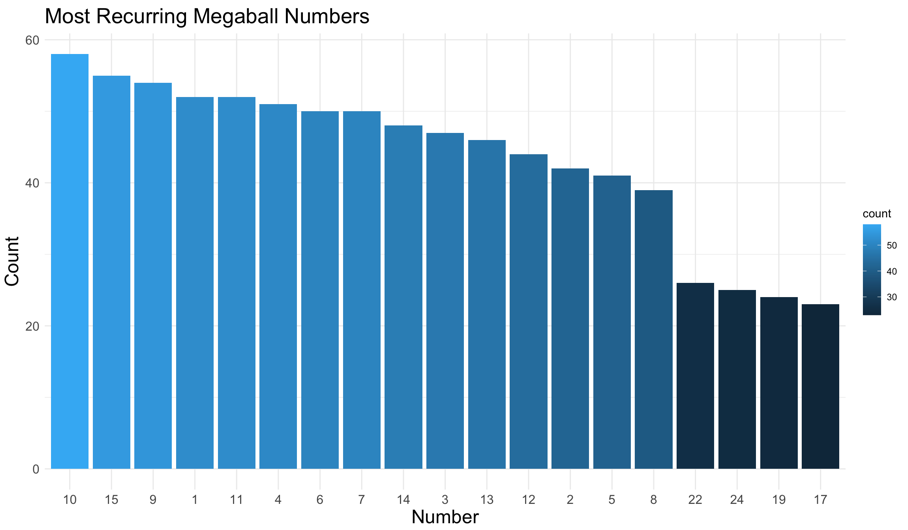
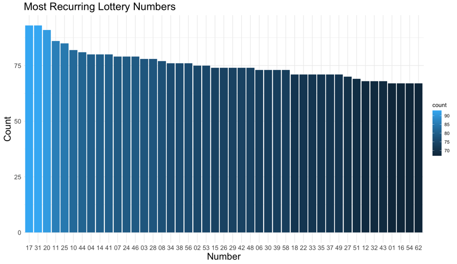
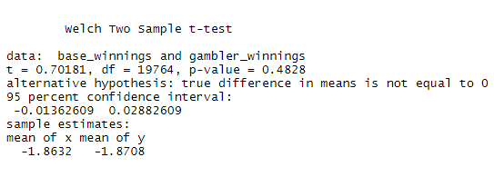
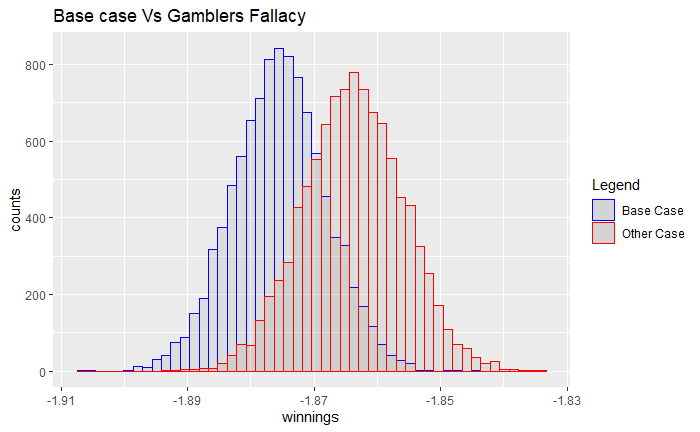
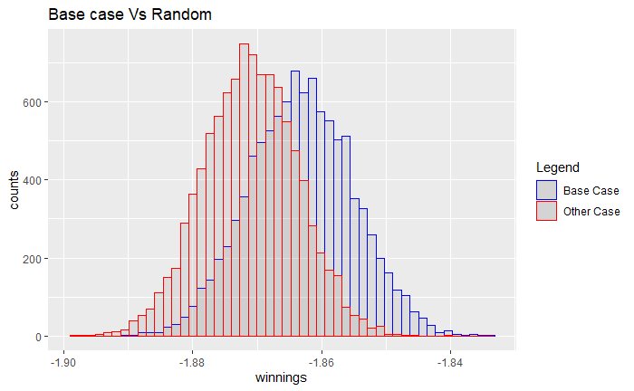
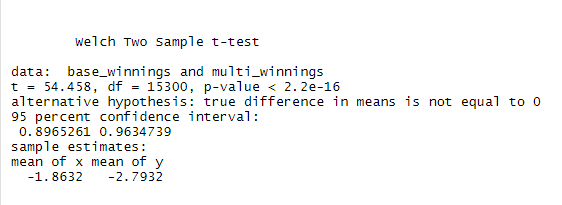
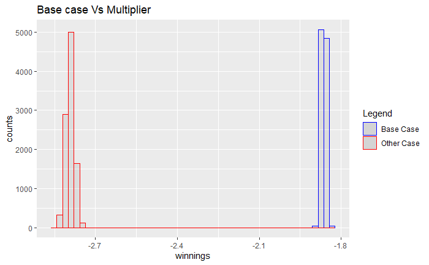
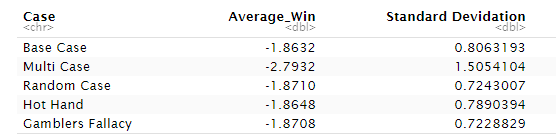

```{r documentSetup, include=FALSE}
knitr::opts_chunk$set(echo = TRUE)
library(kableExtra)
```

## Abstract

The goal of this study is to establish if it is possible to strategically play the lottery in order to increase both prize money, and the chances of winning. To determine this, we focused on the [Mega Millions](https://nylottery.ny.gov/draw-game/?game=megamillions) lottery game. Mega Millions is a United States based lottery that is played twice a week, and is available in 45 states plus the District of Columbia and the U.S. Virgin Islands. To participate in the game, players must select 5 numbers from 1 to 70, and 1 number from 1 to 25 for the Mega Ball. If the player matches all 5 numbers plus the Mega Ball, then they win the jackpot. [Lower prize tiers](https://nylottery.ny.gov/draw-game/?game=megamillions#odds_prizes) are available for matches that fall short of the jackpot requirement.

Our methodology toward satisfying this goal was to compare 4 different approaches to playing the lottery using hypothesis testing. We compared the average winnings of each strategy through the use of T-Tests in order to establish whether or not specific strategies outperformed others in terms of bettering the odds of winning, and increasing return on investment. The results showed no evidence that one strategy was better than another, suggesting that the lottery is purely a game of chance, and that applying strategy to game play has little to no influence over the outcome of the game. 

**Keywords: _probability_, _lottery strategy_, _gambler's fallacy_, _hot hand fallacy_**.

## Introduction

The famous American writer Ambrose Bierce once defined a lottery as "_A tax on people who are bad at math_" (_The Unabridged Devil's Dictionary_). According to the United States Census Bureau's [2020 Annual Survey of State Government Finances](https://www.census.gov/data/tables/2020/econ/state/historical-tables.html), Americans spent more than $80 billion on lottery tickets in 2020 alone. Based on these statistics, it is clear that many Americans, despite the incredibly thin odds of winning the jackpot (_1 in 302,575,350 for the Mega Millions jackpot_), are willing to shun Bierce's advice and part with a significant amount of money for the chance of lifelong financial security.

\newpage

The outrageously slim chances of winning have led to an array of different approaches to playing the lottery in the hope of beating the odds. These range from strategies based on mysticism, such as playing numbers based on [numerology](https://www.mercurynews.com/2019/03/20/want-to-win-tonights-550m-powerball-take-a-deeper-look-at-the-numbers/), to those based on statistical probability, such as playing numbers that have frequently shown up in winning number sets in the past and are thus believed to be more likely to show up in future drawings.

While there may be an unlikely chance that mystical strategies can assist in increasing the odds of winning the lottery, such approaches are unmeasurable and as such, these approaches will not be considered in this study. Instead, we will focus on strategies that are based on statistical probability, and are thus measurable.

In order to assess if these strategies can better one's odds of winning, We will both analyze the past 20 years of winning numbers from the [Mega Millions](https://nylottery.ny.gov/draw-game/?game=megamillions) lottery, and simulate the game using random numbers to answer the following questions:

- Is it possible to predict future winning lottery numbers based on previous results?

- Can a pattern be identified regarding which winning numbers are drawn most often per game over time?

- Can playing these numbers increase our chances of winning, and how does this strategy relate to the [hot hand fallacy](https://en.wikipedia.org/wiki/Hot_hand)?

- Conversely, can avoiding these numbers increase the odds of winning, and how does this strategy relate to the [gambler's fallacy](https://en.wikipedia.org/wiki/Gambler%27s_fallacy)?

- In terms of winning, is it better to play the same numbers, or pick random numbers every game?

- Out of all the strategies under investigation, which strategy gives us the best return on investment (if any)?

\ 

We will compare 5 different game strategies in this study to determine if one or more strategies results in a greater amount of wins. The strategies that we will investigate are as follows:

1. **Consistent Numbers Strategy**  
_Playing the same numbers every game. This strategy is our **base case**_. 

2. **Most Frequent Numbers Strategy**  
_This strategy involves playing numbers that most frequently occurred in past winning number sets_  
_every game and thus adheres to the Hot Hand Fallacy_.

3. **Least Frequent Numbers Strategy**  
_This strategy involves playing the numbers that have least frequently occurred in past winning_  
_number sets every game and thus adheres to the Gambler's Fallacy_.

4. **Random Numbers Strategy**  
_Playing randomly selected numbers every game_. 

5. **Multiplier Strategy**  
_Applying the Mega Millions Megaplier number to the Consistent Numbers Strategy_  
_(Please refer to the "Game Rules"" section of the "Mega Millions Lottery Game" section_   
_for further information on multplier numbers)_.

\newpage

### Mega Millions Lottery Game

Mega Millions is a US multi-state lottery game that is drawn twice a week on Tuesdays and Fridays.
To participate in the game, players purchase one or more lottery tickets at a cost of $2 per ticket.
Players must pick **5** _unique numbers_ from **1** to **70**, and **1** number from **1** to **25** for the _Mega Ball_.
Optionally, players can opt for randomly selected numbers at the time of ticket purchase.

#### Game Rules

Lottery numbers are drawn randomly **twice** a week on _Tuesdays_ and _Fridays_ at 11PM (EST). 
50% of lottery ticket sales is allocated as prize money (_75% of which is used for the jackpot payout_). 
If all of the numbers selected by the player (_including the Mega Ball_) are drawn, then the player wins the jackpot. 
If multiple players win the jackpot, then the jackpot is divided equally among the winning players. 
If no one wins the jackpot for a particular drawing, then the jackpot amount rolls over to the next drawing. 
The remaining 25% of the prize money is then allocated to lower tiered prizes.

```{r, prizeTiers, echo=FALSE, message=FALSE, warning=FALSE}
tableData <- data.frame(c("Jackpot", "Second Prize", "Third Prize", "Fourth Prize", "Fifth Prize",  "Sixth Prize", "Seventh Prize", "Eighth Prize", "Ninth Prize"),
                        c("5 matching numbers with the Mega Ball", "5 matching numbers", "4 matching numbers with the Mega Ball",
                          "4 matching numbers", "3 matching numbers with the Mega Ball", "3 matching numbers", "2 matching numbers with the Mega Ball",
                          "1 matching number with the Mega Ball", "No matching numbers with the Mega Ball"),
                        c("75% of the total prize money", "$1,000,000", "$10,000", "$500", "$200", "$10", "$10", "$4", "$2"),
                        c("1 in 302,575,350", "1 in 12,607,306", "1 in 931,001", "1 in 38,792", "1 in 14,547", "1 in 606", "1 in 693", "1 in 89", "1 in 37"))
                          
colnames(tableData) <- c("Prize", "Winning Criterion", "Payout", "Odds of Winning")

kable(tableData, caption = 'Prize Tiers and Payouts') %>%
      kable_styling(bootstrap_options = c('striped', 'hover', 'condensed', 'responsive'), latex_options = "HOLD_position") %>% 
      scroll_box(width = '100%')
```

Additionally, Players can pay an extra dollar to purchase a multiplier number known as the _Megaplier_. Multiplier numbers range from **2** to **5**. If a player picks a winning multiplier number and also winning lottery numbers, then the payout for the winning lottery numbers will be multiplied by the winning multiplier number. 


## Data Source

The data that we utilized for this study was supplied by [NY Open Data](https://data.ny.gov/), and consists of biweekly winning Mega Millions lottery numbers from 2002, through the current week. The dataset is in CSV format and can be accessed at the following location - [Lottery Mega Millions Winning Numbers: Beginning 2002](https://data.ny.gov/Government-Finance/Lottery-Mega-Millions-Winning-Numbers-Beginning-20/5xaw-6ayf/data). As of writing, the set contains 2058 observations broken into 4 columns:

- **Draw Date**: _The date on which the lottery draw took place_.
- **Winning Numbers**: _The winning numbers for the given lottery draw_.
- **Mega Ball**: _The winning Mega Ball for the draw_.
- **Multiplier**: _The winning multiplier number for the draw_.

\newpage

## Literature Review

In a 2012 study on predicting lottery numbers (_Galbo-Jørgensen, Claus B., Suetens, Sigrid., Tyran, Jean-Robert. 2012_), it was observed that many lottery players fall prey to the [gambler's fallacy](https://en.wikipedia.org/wiki/Gambler%27s_fallacy) when picking lottery numbers. According to the gambler's fallacy, players tend to avoid picking numbers that were recently included in the winning numbers set under the believe that if an event occurred recently, it is less likely to occur again. Contrary to this, other players pick numbers in accordance with the [hot hand fallacy](https://en.wikipedia.org/wiki/Hot_hand) which is the believe in a continuation of a trend, i.e. if specific numbers were recently included in the winning numbers set, then they are more likely to occur in future drawings [(1)](#references).

_Otekunrin and Folorunso_ (_2021_) observed that some players will select lottery numbers based on personally significant numbers such as birthdays, house numbers, anniversary dates etc., whilst others heuristically choose numbers based on their frequency of occurrence in previous drawings. When a heuristic approach is applied to lottery number selection, it was observed that players tend to believe that well-spread out numbers are better than distinctive ones even though both have the same probability of occurrence [(2)](#references).

While the aforementioned studies are concerned with the psychology behind picking lottery numbers, this study focuses on whether or not these selection techniques increase one's chances of selecting winning lottery numbers. We are more concerned with proving these techniques to be either effective or ineffective through the application of mathematics, than with why people believe them to be so.

This approach is in the same vein as Renato Gianella's approach to this subject. _Gianella_ (_2014_) observed that winning lottery number combinations follow a predictable pattern. By applying probability theory to lottery drawings, Gianella established that the results of a lottery draw follow the same behavior pattern as predicted by the Law of Large Numbers - _When an event is repeated many times, the average of the results from all events should be close to the expected result_ [(3)](#references).

Gianella's method is based on groups of number combinations built from previous lottery results. When tested, his method demonstrated that the probability that a given number combination occurs is not the same for all groups, and that certain groups display a higher probability of winning.

This study does not assume that Gianella's method is effective, rather it sets out to adopt similar logical strategies to prove that Gianella's method, and other strategies are either effective or ineffective in increasing one's chances of winning the lottery.


## Methodology

The core focus of this study is to determine if one or more of the strategies outlined in the introduction (_Consistent Numbers Strategy_, _Multiplier Strategy_, _Random Numbers Strategy_, _Most Frequent Numbers Strategy_, and _Least Frequent Numbers Strategy_) can either increase our chances of winning the lottery, or give us a better return on investment. In order to evaluate this, we wrote several simulators in R that simulate playing each of these strategies against randomly generated winning numbers in order to simulate an actual Mega Millions lottery game.

The tickets generated for each of the above listed strategies comprise of _**5** random unique numbers between **1** and **70**_ that make up the base numbers on the ticket, and _**1** number between **1** and **25**_ for the Mega Ball number. In the case of the Multiplier Strategy, an additional number _between **2** and **5**_ was generated for the Megaplier number. We then ran 10,000 trails for each individual strategy.

For our base case strategy (_The Consistent Numbers Strategy_) we randomly generate 1 lottery ticket to rule out human bias, and played the same ticket against a randomly generated winning ticket each time.

For the Random Numbers Strategy, we generated a different lottery ticket consisting of random numbers for each trail, and played it against a randomly generated winning ticket each time.

For the Multiplier strategy, we used our base case (_The Consistent Numbers Strategy_) and just applied the multiplier number logic (_i.e. If both a winning multiplier number and winning lottery numbers are selected, then the payout for the winning lottery numbers is multiplied by the winning multiplier number_). 

For the last two strategies that we evaluated (_the Least and Most Frequent Numbers strategies_) we leveraged the _NY Open Data Mega Millions Winning Numbers_ dataset in order to select the most and least frequent winning numbers. This involved analyzing the dataset and rank ordered the occurrence of individual numbers, and Mega Balls. We then used the top 50 percentile to represent the most frequent numbers, and the bottom 50 percentile to represent the least frequent numbers.

For the Least Frequent Numbers strategy, we generated a single random lottery ticket using the least frequent winning numbers extracted from the Mega Millions Winning Numbers dataset and then played the same ticket against a randomly generated winning ticket for each trail.

The same approach was adopted for the Most Frequent Numbers strategy only in this case, we used the most frequent winning numbers extracted from the dataset rather than the least frequent.

In order to evaluate the effectiveness of each strategy in terms of increasing the odds of winning and return on investment, we adopted a Hypothesis Testing approach and compared the average winnings for each of the above 4 strategies (_Least and Most Frequent Numbers strategies, Multiplier, and Random Numbers strategies_) to those of our base case. The metric that we focused on during this comparison was the average win amount across 10,000 trials. The average winnings were evaluated with a 95% confidence interval.

This comparison was carried out using **T-tests**. T-tests were the ideal comparison method for this study as they provided us with a means by which to determine the significance of difference between each strategy's mean.

### Most and Least Frequent Numbers Strategies

The Most and Least Frequent Numbers strategies deserve their own section within our methodology as the preperation behind these strategies was more involved than that of the other 3.

The Most and Least Frequent Numbers strategies are based on the Hot Hand Fallacy (_the believe that selecting winning numbers that occurred frequently in the past will better your odds of winning_), and the Gambler's Fallacy (_the believe that not selecting such numbers will better your odds of winning_) respectively.

In order to simulate both of these approaches, we first needed to find the numbers that conformed to each philosophy. To do this, we ran through the historical Mega Millions winning numbers data and calculated the frequency of both the most and least frequently occurring Mega Ball and Base numbers. We then ranked each number in accordance to its frequency.

This provided us with a set of the top _n_ most/least recurring numbers from which to create tickets for use in our Hot Hand and Gambler's Fallacy (_Most and Least Frequent Numbers strategies_) based simulations. This process left us with the following Mega Ball and Base Number pools from which to pull from:

\newpage

\begingroup\centering

#### Most Recurring Numbers Set

\ 







\endgroup


\ 
\ 

\newpage

\begingroup\centering

##### Least Recurring Numbers Set

\ 


\endgroup

For the Most Frequent Numbers strategy, we created 1 random ticket consisting of numbers pulled from the Most Recurring Numbers set (_5 Base numbers, and 1 Mega Ball number_). The same approach was taken for the Least Frequent Numbers strategy only for this strategy, the numbers were drawn from the Least Recurring Numbers set.


 
## Results

For ease of interpretation, the findings of this study have been segmented into sections corresponding to the strategies that they derived from. Each section consists of the T-Test results that were generated as a consequence of comparing the average winnings of the strategy under discussion, with those of the base case. Further, each section contains a visual representation of comparison results in the form of a distribution histogram.

As the comparison section of this study was based on hypothesis testing, each section contains the _null_ and _alternative_ hypotheses corresponding to the strategy they are listed under. However, the general _null_ and _alternative_ hypotheses of the study can be interpeted as follows:

**Null Hypothesis (_H0_)**: A specific strategy is the same as the base case in terms of average winnings generated and therefore neither strategy will result in more winnings.

**Alternative Hypothesis (_Ha_)**: A specific strategy is not the same as the base case in terms of average winnings generated and therefore playing the strategy under comparison, or the base strategy, will result in more winnings.

\ 


**Most Frequent Numbers Strategy (_Hot Hand Fallacy approach_)**

$\text{Ho: }\mu_{base}-\mu_{most frequent} = 0$

$\text{Ha: }\mu_{base}-\mu_{most frequent} \neq 0$


The T-test results above reveal a **_p_** value of **_0.8872_** indicating that the average winnings of the Most Frequent Numbers strategy are not significantly different from those of the base case. We therefore cannot reject the null hypothesis that the _Most Frequent Numbers strategy is the same as the base case in terms of average winnings_. This is further consolidated by the insignificant **_t_** value of **_0.14182_**.

To get a better understanding of the test outcome, we plotted the results. The subsequent histogram confirms that the average winnings generated by the Most Frequent Numbers strategy fall within the expected values of the base case, thus proving the T-Test to be accurate. Furthermore, the chart reveals that both strategies yield negative winnings. When we consider a win to be **_total winnings - total ticket spend_**, this suggests that we cannot rely on either strategy to increase our winnings.  


\ 

**Least Frequent Numbers Strategy (_Gambler's Fallacy approach_)**

$\text{Ho: }\mu_{base}-\mu_{most frequent} = 0$

$\text{Ha: }\mu_{base}-\mu_{most frequent} \neq 0$

We next compared the Least Frequent Numbers strategy to the base case which yielded the following T-test results:



As with the Most Frequent Numbers strategy's T-Test results, the Least Frequent Numbers strategy's **_t_** and **_p_** values of **_0.70181_** and **_0.4828_** respectively reveal that there is not a significant difference in the average winnings for this strategy versus those of the base case. Before rejecting the null hypothesis, we plotted the results in order to gain insight into the distributions generated by both strategies. 



Whilst there is less overlap between the distributions of this strategy and the base case than there was with the Most Frequent Numbers strategy, it is still evident that the values fall within the expected values of the base case. Therefore, based on this evidence and the evidence provided by the T-Test, we can conclude that the Least Frequent Numbers strategy does not result in more winnings than the base case and as such, we cannot reject the null hypothesis that the _Least Frequent Numbers strategy is the same as the base case in terms of average winnings_.

\ 

### Random Numbers Strategy

$\text{Ho: }\mu_{base}-\mu_{most frequent} = 0$

$\text{Ha: }\mu_{base}-\mu_{most frequent} \neq 0$


Comparing the average winnings from the Random Numbers and Consistent Numbers strategies, we were able to obtain **_t_** and **_p_** values of **_0.71965_** and **_0.4718_** respectively. This reveals that there is not a significant difference in the average winnings for this strategy versus those of the base case as a t-score of 0.71965 is within bounds when using a 95% confidence interval. Based on these results, we are unable to reject the null hypothesis, and assume that the average winnings for both strategies are the same.




Plotting the distribution of the sample means further proves this as it reveals overlap between the Random Numbers and Consistent Numbers strategies. Here we can clearly see that the means are within 95% of each other.


### Multiplier Strategy

$\text{Ho: }\mu_{base}-\mu_{most frequent} = 0$

$\text{Ha: }\mu_{base}-\mu_{most frequent} \neq 0$



Comparing the average winnings from the Multiplier and Consistent Numbers strategies, we obtained a **_t_**  value of **_54.458_**, and a near **0 _p_** value. This reveals that there is a significant difference in the average winnings for the Multiplier strategy versus the base case as  **_t_**  = 54.458, which is well out of bounds when using a 95% confidence interval. Due to the significant difference, we are able to reject the null hypothesis and accept the alternative hypothesis that the average winnings for both strategies are different.

This is an outlier in our results. All of the other strategies thus far have resulted in the alternative hypothesis being rejected. To get a better understanding of what might be happening here, we turned to the distribution histogram.     




Looking at the sample distribution of the means, it is clear that the average winnings between the two methods are different. However, at closer inspection, we can see that we are dealing with negative winnings. Therefore, as nice as it would have been to have finally identified a winning strategy, we found that using the Multiplier strategy, a strategy that should increase our winnings, turned out to have the opposite effect.

A win is considered to be **_total winnings - total ticket spend_**. Given the slim odds of winning, the extra dollar required to add a multiplier number to a lottery ticket tips the scales and rather than working in our favor, we end up losing even more money.   

\ 

### Comparison Of Results Table



\ 

When looking at the results of each experiment collectively, it is clear that the average lose in winnings for the Random, Most Frequent (_Hot Hand Fallacy_), and Least Frequent (_Gambler's Fallacy_) Numbers strategies are all very close to those of the base case (_They all result in average winnings of -1.8_). The obvious outlier here is the Multiplier strategy which results in an average lose in winnings of -2.8, making this the worst strategy in terms of return on investment. 

\newpage

## Conclusion

Based on our experiments, we can conclude that consistently picking the same numbers (_base case_) every game will not give you anymore of an advantage in terms of winning the lottery than randomizing your number choices, or picking numbers based on past results. Furthermore, we discovered that paying the extra dollar for the multiplier number (_a strategy that is supposed to increase your winnings_) actually results in a higher loss due to the higher cost of the lottery ticket. In conclusion, we believe that the lottery is not worth playing as the average amount won is less than the amount spent on tickets. This average does not get better based on how numbers are picked, but does get worse when you pay more for a chance at a multiplier.


### Future Work

While we started out hopeful that we would discover a solid strategy for winning the Mega Millions lottery, the results of this study dwindled our hopes and proved that such a strategy is unattainable. Although it is almost assured that this truth can be applied to lottery games in general, follow-up studies could explore applying the strategies we investigated to different lottery games in order to be able to make this claim with certainty.

Lottery games such as New York's **_[Win4](https://nylottery.ny.gov/draw-game?game=win4)_** only require 4 numbers to be matched in order to win the jackpot. Whilst the payouts are considerably less than those of the Mega Millions lottery, the odds of winning the jackpot are remarkably greater (_1 in 10,000_). Given this drastic change in odds and the fact that fewer matching numbers are required to win, future studies could investigate how our results would differ when applying the 4 strategies we applied to the Mega Millions game. Such comparisons could benefit follow-up studies by revealing new attainable strategies to playing the lottery that deserve further investigation. For example, is it possible to win a certain amount of money with less tickets playing a game that requires fewer matching numbers than it takes to win the same amount of money playing the Mega Millions lottery?  


## References  {#references}

1. **_Galbo-Jørgensen, Claus B., Suetens, Sigrid., Tyran, Jean-Robert. (2012)_** \
[Predicting Lotto Numbers - A natural experiment on the gambler’s fallacy and the hot hand fallacy](https://www.parisschoolofeconomics.eu/IMG/pdf/suetens_paper.pdf)
    
2. **_Oluwaseun A. Otekunrin., Adesola G. Folorunso., Kehinde O. Alawode. (2021)_** \
[Number Preferences In Selected Nigerian Lottery Games](http://journal.sjdm.org/20/201204a/jdm201204a.pdf)

3. **_Gianella Renato. (2014)_** \
[The Geometry Of Chance:Lotto Numbers Follow A Predicted Pattern](http://jaguar.fcav.unesp.br/RME/fasciculos/v31/v31_n4/A7_RGiarelli.pdf)


## Bibliography

1. **_Grace M. Barnes, John W. Welte, Marie-Cecile O. Tidwell, Joseph H. Hoffman. (2010)_** \ 
[Gambling on the Lottery: Sociodemographic Correlates Across the Lifespan](https://link.springer.com/article/10.1007/s10899-010-9228-7)

2. **_Hwai-Chung Ho, Shih-Chin Lee & Hsiou-wei Lin. (2019)_** \
[Modelling Of How Lotto Players Select Their Number Combinations Dynamically](https://www.researchgate.net/profile/Shih-Chin-Lee-2/publication/328269835_Modelling_of_how_lotto_players_select_their_number_combinations_dynamically/links/5f695d49a6fdcc0086342140/Modelling-of-how-lotto-players-select-their-number-combinations-dynamically.pdf)

3. **_Suetens, Sigrid and Tyran, Jean-Robert. (2011)_** \
[The Gambler’s Fallacy and Gender](https://deliverypdf.ssrn.com/delivery.php?ID=776114008100073125083084008110114014038018014015006038127117107011069081076117012007106099010022103035124023026122000097092018126008014016039107086015118115099122037061009111126103116099076112005031072127090112076065115003096001125101098067082123117&EXT=pdf&INDEX=TRUE)

4. **_Garrett Thomas A., Sobel Russell S. (2004)_** \
[State Lottery Revenue: The Importance Of Game Characteristics](http://faculty.citadel.edu/sobel/All%20Pubs%20PDF/State%20Lottery%20Revenue.pdf)

5. **_Benedicte Apouey and Andrew E. Clark. (2015)_** \
[Winning Big But Feeling No Better? The Effect Of Lottery Prizes On Physical And Mental Health](https://www.ncbi.nlm.nih.gov/pmc/articles/PMC4180795/)

6. **_Sefton Martin, Morgan John (2000)_** \
[Funding Public Goods With Lotteries: Experimental Evidence](https://econweb.ucsd.edu/~jandreoni/Econ264/papers/Morgan%20Sefton%20RES%202000.pdf)


## Appendix 

https://github.com/stephen-haslett/Data698ResearchProject

Add links to individual files along with a summary explaining each file.
